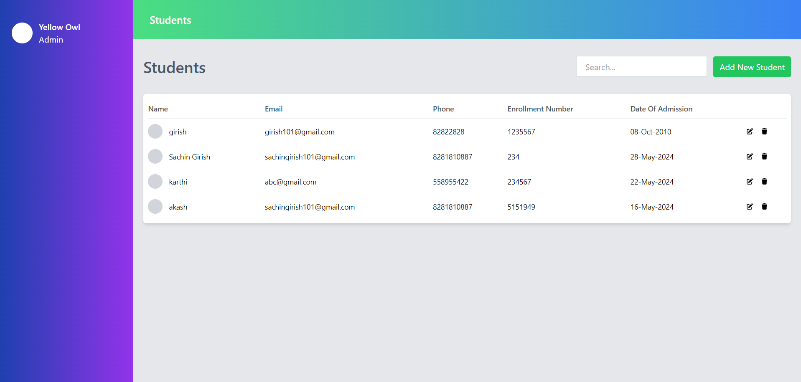

# Student Management System

A simple student management system built with TypeScript, Express, MongoDB, and React.

## Live link

[Click here](https://yellow-owl.vercel.app/)
note - initial loading takes time as it takes 50 - 60 seconds to start the server.

## Table of Contents

- [Installation](#installation)
- [Usage](#usage)
- [API Endpoints](#api-endpoints)
- [Technologies Used](#technologies-used)
- [Project Structure](#project-structure)


## Installation

1. Clone the repository:

```bash
   git clone https://github.com/sac1010/yellow-owl.git
   cd yellow-owl
```
2. Install server dependencies:
```bash
   cd server
   npm install
```
3. Install client dependencies:
```bash
   cd ../client
   npm install
```
4. Set up environment variables:
Create a .env file in the server directory and add the following:
```bash
MONGODB_URI=
PORT=3000
```
Create a .env file in the client directory and add the following:
```bash
REACT_APP_API_BASE_URL= https://yellow-owl.onrender.com/
```

## Usage

1. Start the server
```bash
cd server
npm run dev
```
The server will start on http://localhost:3000.

2. Start the client
```bash
cd client
npm start
```
The client will start on http://localhost:5173. 

## API Endpoints
Base URL: http://localhost:3000/api

- GET /students - Get all students
- POST /students - Create a new student
- PUT /students/:id - Update a student by ID
- DELETE /students/:id - Delete a student by ID

## Technologies Used

1. Backend:

- TypeScript
- Node.js
- Express
- MongoDB
- Mongoose

2. Frontend:

- React
- TypeScript
- Tailwind css
- react-table

# Screenshots

